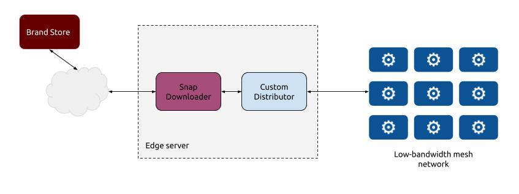

# Snap Downloader

 
Snap downloader creates a local cache of snaps and assertions for snaps in
a brand store. Why? Some devices have very limited network bandwidth e.g. a zigbee mesh,
so it is not practical for them to download snaps directly from a snap store.

Once snap downloader is authorized to access a brand store, snaps can be registered to
be watched. Whenever a new version appears at the brand store, the snap is downloaded to
the local cache. The application provides an API for external applications to retrieve
the cached files and distribute them to the low-bandwidth network.

Snap downloader downloads the snap and its assertion from the brand store, so it can be
installed onto a device without using the `--dangerous` flag. An example of an
that handles the installation of the assertion and snap is [Snap Sideloader](https://github.com/slimjim777/snap-sideloader).

## Web interface
Snap downloader provides a web interface to help get started with the application. Just
browse to http://edge-server-ip:8888/ e.g. http://localhost:8888 if testing locally.

The web interface allows a user to:

 - Login to a brand store (storing the authentication macaroon locally)
 - Manage which snaps are cached
 - View and download the files in the local cache 


## API

### Login to the store
`POST /v1/login`

Authenticate with the store and cache the macaroon in the local database.

#### Request

| Attribute | Type   | Description              |
| --------- | ------ | ---------------------    |
| email     | string | Ubuntu SSO email address |
| password  | string | Ubuntu SSO password      |
| otp       | string | One-time password        |
| store     | string | Brand store ID           |
| series    | string | Model assertion series   |

#### Response

| Attribute | Type   | Description              |
| --------- | ------ | ---------------------    |
| code      | string | Error code               |
| message   | string | Error message            |

```
curl -X POST -d '{"email":"john@example.com", "password":"notasecret", "store":"my-great-store", "series":"16", "otp":"123456"}' http://localhost:8888/v1/login
```

### List snaps to watch
`GET /v1/snaps`

List the snaps that will be watched for updates

#### Response

| Attribute | Type   | Description              |
| --------- | ------ | ---------------------    |
| code      | string | Error code               |
| message   | string | Error message            |
| records   | array  | List of snaps            |

```
curl http://localhost:8888/v1/snaps
```
```
{
    "code": "",
    "message": "",
    "records": [
        {
            "id": "bu9eiuh105lr9jbvh130",
            "name": "iotdevice-verticals",
            "arch": "amd64",
            "created": "2020-10-23T14:32:26Z",
            "modified": "2020-10-23T14:32:26Z"
        },
        {
            "id": "bu9ej01105lr9jbvh13g",
            "name": "logsync-james",
            "arch": "amd64",
            "created": "2020-10-23T14:32:32Z",
            "modified": "2020-10-23T14:32:32Z"
        }
    ]
}
```

### List the downloaded snaps
`GET /v1/downloads`

List the snaps in the download cache.

```
curl http://localhost:8888/v1/downloads 
```
```
{
    "code": "",
    "message": "",
    "records": [
        {
            "name": "iotdevice-verticals",
            "arch": "amd64",
            "revision": 2,
            "assertion": "iotdevice-verticals_2_amd64.assert",
            "size": 6283264,
            "filename": "iotdevice-verticals_2_amd64.snap"
        },
        {
            "name": "logsync-james",
            "arch": "amd64",
            "revision": 38,
            "assertion": "logsync-james_38_amd64.assert",
            "size": 4419584,
            "filename": "logsync-james_38_amd64.snap"
        },
        {
            "name": "logsync-james",
            "arch": "amd64",
            "revision": 72,
            "assertion": "logsync-james_72_amd64.assert",
            "size": 4419584,
            "filename": "logsync-james_72_amd64.snap"
        }
    ]
}
```

### Download a snap file or assertion
`GET /v1/downloads/{name}/{filename}`

Download a snap file or its assertion. The name of the file can be seen in the `List downloads` response.

```
curl -o output.assert http://localhost:8888/v1/downloads/logsync-james/logsync-james_72_amd64.assert
```

### Download a snap delta
`GET /v1/delta/{name}/{arch}/from-revision/to-revision`

Generate a binary delta of a snap file from one specific revision to another. Both revisions
must be in the download cache. The delta is created using `xdelta3`.

```
curl -o output.delta3 http://localhost:8888/v1/delta/logsync-james/amd64/38/72
```
